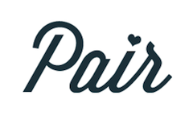
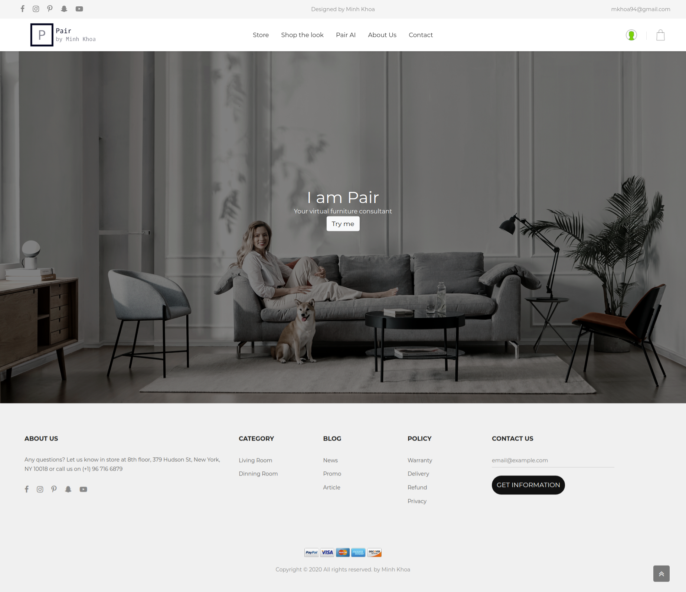
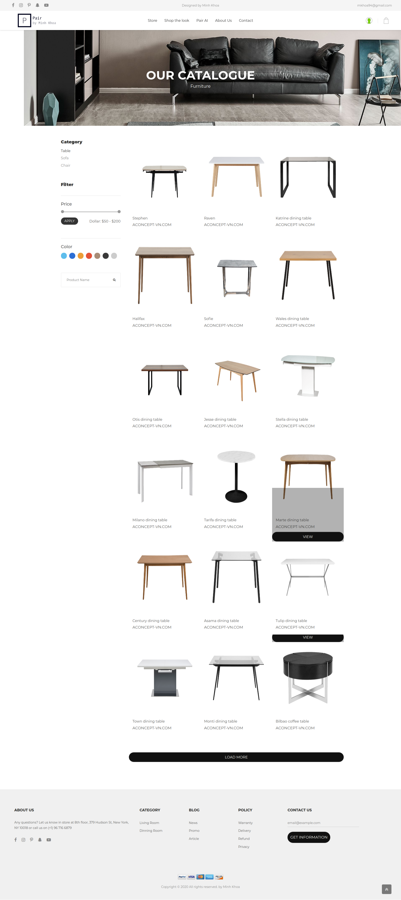
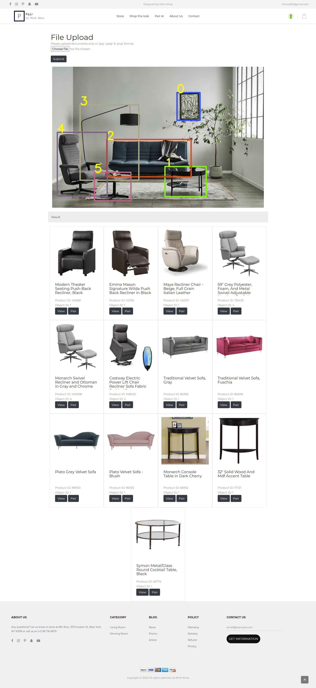
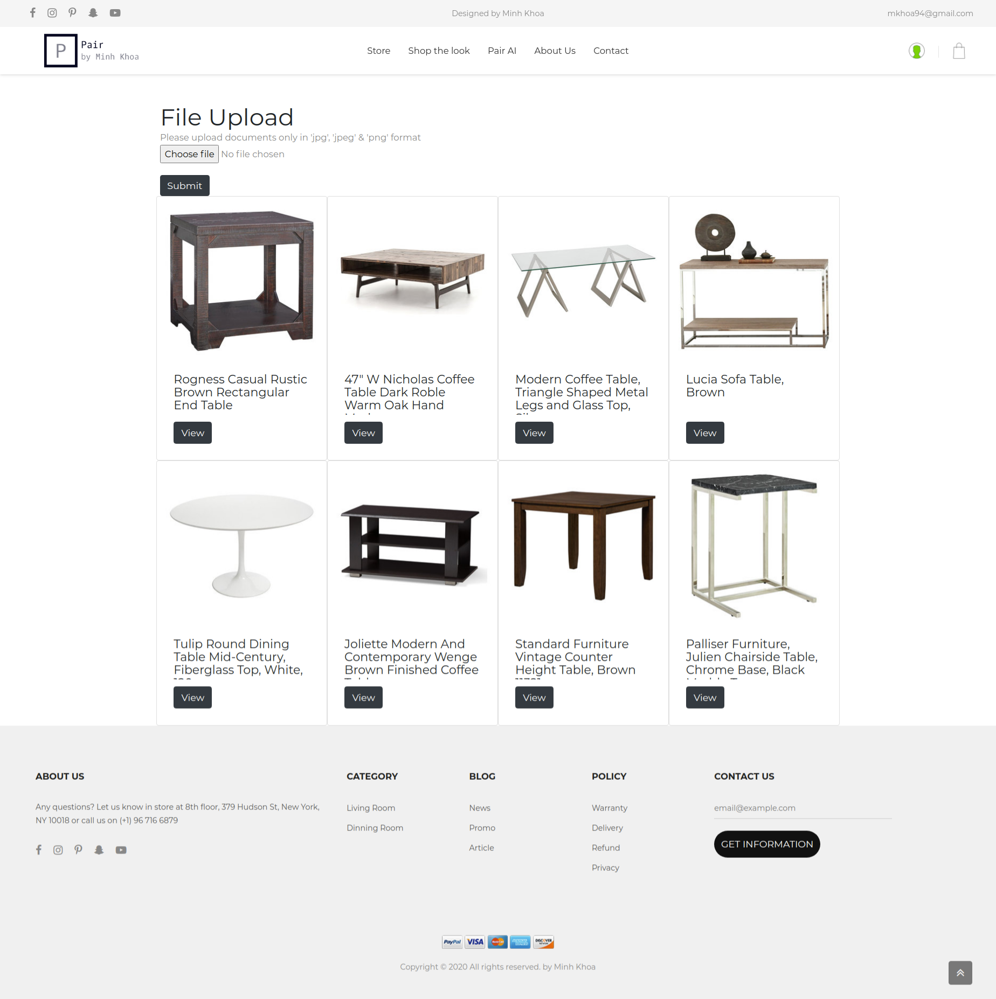

# Furniture Recommendation Systems



## Introduction


Pair is an image-based product recommender for matching visually similar products across categories. User upload an image of a preferred furniture, and the model will look up for similar products existed in product database and return furniture from another categories that have similar design.

## Deployment
![screenshot/Demo Setup.png]

## Installation
This app use Google Cloud Vision API and Google Cloud Storage to predict and store data. Please put service_account.json inside this location.
```
credentials/abstract-veld-289612-327ddac80eba.json
```

For database, MySQL is used with following credential:
```
conn = pymysql.connect(
    host='localhost',
    port=int(3306),
    user="mkhoa",
    passwd='CoderSchool@2020',
    db="Pair",
    charset='utf8mb4')
```
Will update codebase to use local images and database for easy demo

## Streamlit Mode
Install dependencies

```
streamlit run app.py
```

## Flask Mode

```
export FLASK_APP=app.py
flask run -h 0.0.0.0 -p 8080
```
## Screenshot
</img> 
</img> 
</img> 
</img> 

