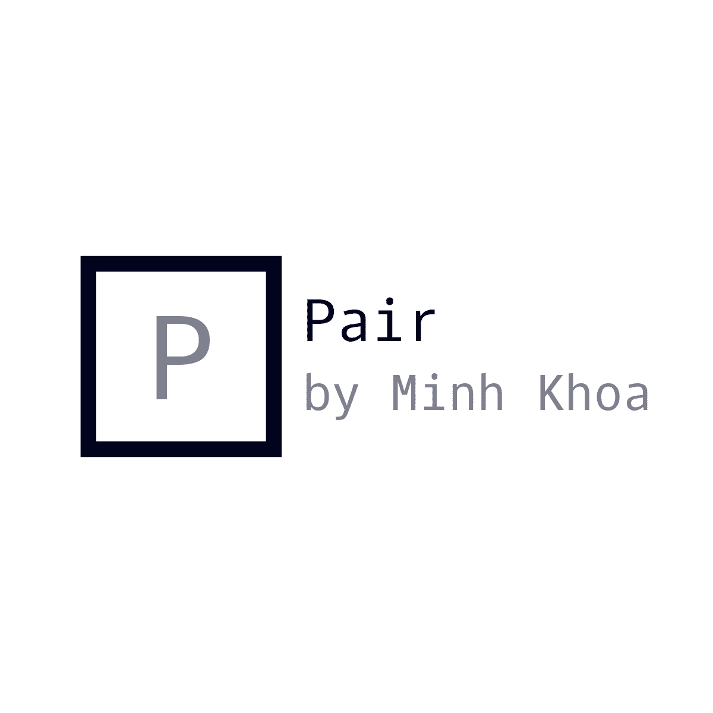

# Pair by Minh Khoa



## Introduction


Pair is an image-based product recommender for matching visually similar products across categories. User upload an image of a preferred furniture, and the model will look up for similar products existed in product database and return furniture from another categories that have similar design.

## Streamlit Mode
Install dependencies

```
pip install streamlit
streamlit run app.py
```

## Flask Mode

```
export FLASK_APP=app.py
flask run -h 0.0.0.0 -p 8080
```
## Screenshot


        

